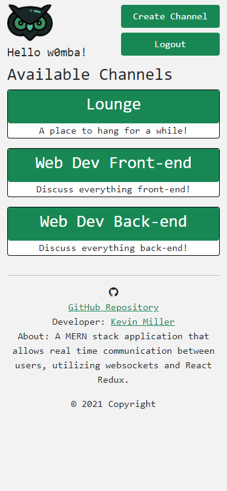

# Chat Application (React-Redux & Socket.io)

## Description

A MERN stack application that allows real time communication between users, utilizing websockets, React-Redux, and MongoDB.

## Table of Contents

- [Installation](#installation)
- [Usage](#usage)
- [Contributing](#contributing)
- [Tests](#tests)
- [Future Development](#future-development)
- [Questions](#questions)

## Installation

_Steps required to install package:_

To install locally, clone repository down to your machine. Then in your IDE navigate to server.js file and open in terminal. From there `npm i` will install all necessary front-end and back-end dependencies.

## Usage

_Examples of project use:_

Project is intended to be used for real-time communication between users. Users can create, join, or leave channels. Once in a channel, messages will be sent to all other users currenty in the channel and are also saved to the DB for persistent conversations.

If you would like to demo the application, please visit the below Heroku link and utilize the below login information:

[Heroku](https://calm-springs-46357.herokuapp.com/)

_Guest Login Information:_

Email: guest@guest.com

Password: demo312

## Contributing

_If you are interested in contributing to this project, please follow the below instructions:_

Pull requests not welcome at this time. Thank you.

## Tests

_Application tests and instructions for them:_

N/A

## License

MIT License

## Future Development

    - Edit / Delete messages
    - Allow users to choose/upload avatar
    - Emoji Keyboard
    - Image/small video upload
    - Further CSS updates
    - User is typing... functionality
    - Display active users in each channel

## Questions

_If you have any questions regarding this application, please utilize the below contact information:_

[kmiller343@gmail.com](mailto:kmiller343@gmail.com)

[GitHub Profile](https://www.github.com/k1te-m)
